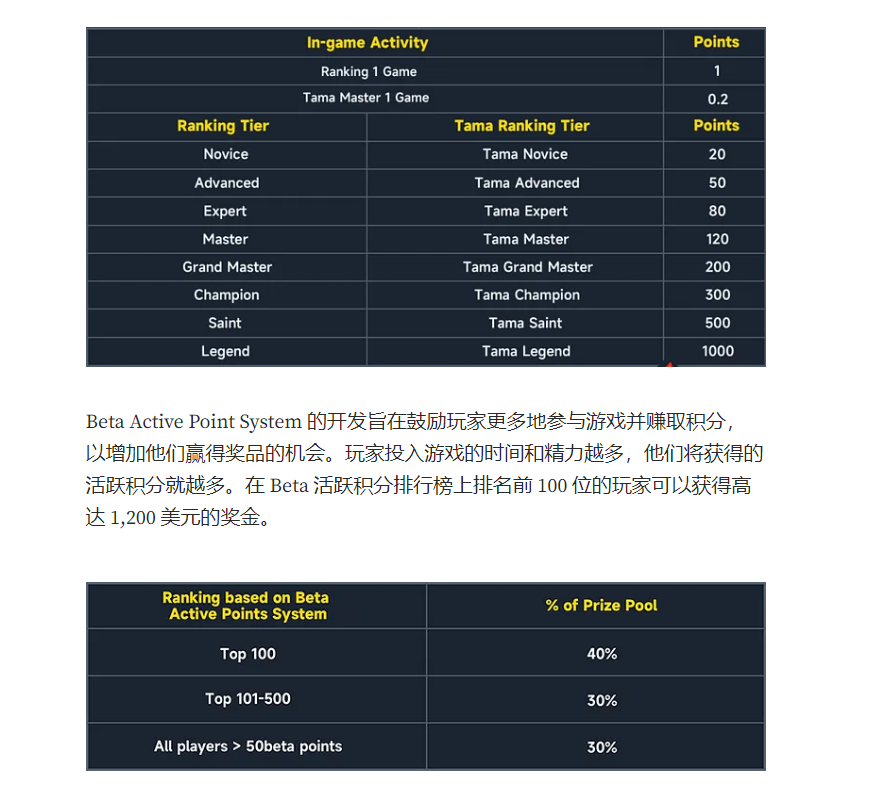

# mjmeta 444

### intro 123666

日本麻将, 又叫做立直麻将, 玩法最复杂的麻将

* 当前人数很少, 大概只有几百 几千号玩家吧, 舍得肝能打到很前面
* 可以参考视频 https://www.youtube.com/watch?v=VLSkzHv6dx8\&ab\_channel=CryptoWilson%E5%8D%80%E5%A1%8A%E9%8F%88-GameFi%2CNFT%2C%E5%B9%A3%E5%9C%88%E6%99%82%E4%BA%8BWTC%E5%A8%81%E8%99%8E%E7%A4%BE%F0%9F%90%AF
* 官方参考 https://mahjong-meta-1.gitbook.io/mahjong-meta-whitepaper/gameplay/gameplay/tama-master-tama-ranking

### 瓜分U奖励

当前主要可以做的是 增加活跃度 AP

#### 如何获得active points

1. 一次有效对战增加1点 AP, 提升角色等级可能有 AP
2. 宠物战斗一次 增加 0.2
3. 交易500-1000 等于 10 AP
4. 一周统计一次, 每周最多 100 APs

其他 1. 合成奖励没开 2. 邀请奖励没开 3. 锁仓奖励没开

#### 排名

1. 按照 newsletter, 现在基本查不到

#### 瓜分U奖励

当前游戏人数大概只有100-200号吧, 比较好刷

* 前100个人瓜分 30WU的 40%, 算下来是每人最高 1200U
* 前100-500瓜分 30WU的 30%, 也就是 每人 225U
* 剩下所有人瓜分 剩下 30% .. 大概率是参与过就有

#### 其他事项:

* 活动 6-8周, 5.12-7.12 左右
* 三成奖励发放到钱包, 七成发放到正式版游戏

参考官方文章: https://medium.com/@mahjongmeta/mahjong-meta-launches-beta-with-up-to-300k-in-rewards-6e8d486c187e

### 其他活动

* 第一期NFT已经结束, Freemint 现在的价格到了0.5\~0.6, 现在准备第二期, 6000个, 依旧 freemint

### 玩法

培养宠物: 选用挂机模式, 可以多挂几次

* 经验值会提升, 提升满了以后记得升级, 点那个UP!
* 三级可以交配
* 挂机过程中会随机掉落技能, 可以给他技能增加耐久度, 或者交易

游戏还是挺有特色, 挺好玩的, 基于最传统最热门的游戏麻将, 同时又不乏一些web3 经典的赌博成分 (后期大概率发展成输赢钱模式? )

其他思路: 开小号挂机, 多号撸

官方 @0xMJM 关注我@gm1thai

推荐项目的大佬参与过跑鞋, 上半年玩其他链游, 快A7了.

## tool

https://github.com/EndlessCheng/mahjong-helper

## tuto

https://steamcommunity.com/sharedfiles/filedetails/?id=2700819375

https://zhuanlan.zhihu.com/p/441954607

https://www.zhihu.com/question/267228188

### MJU = Marvelous Joy Utility Token

MJU is a 100% on-chain stable token that is fully backed by USDT and USDC assets. Each USDC or USDT in the reserve will be worth 10 MJU, providing stability and security to MJU holders.

1 MJU=0.1 USDT/USDC

### DC 聊天

你活躍點領取的獎勵，就跑到待領取獎勵，打一場再領5%出來這樣，但是好像是發到你倉庫的其他，有一張卡說有多少錢，搞不好跟以後發給正式服的獎勵有關喔?

倉庫打開，其他，有一張卡

那我真正领到的奖励哪里可以看吗

Mahjong Meta Beta 计划持续 6 到 8 周。在此期间，玩家将有机会探索游戏，提供有价值的反馈，为不断提升游戏体验做出贡献。
