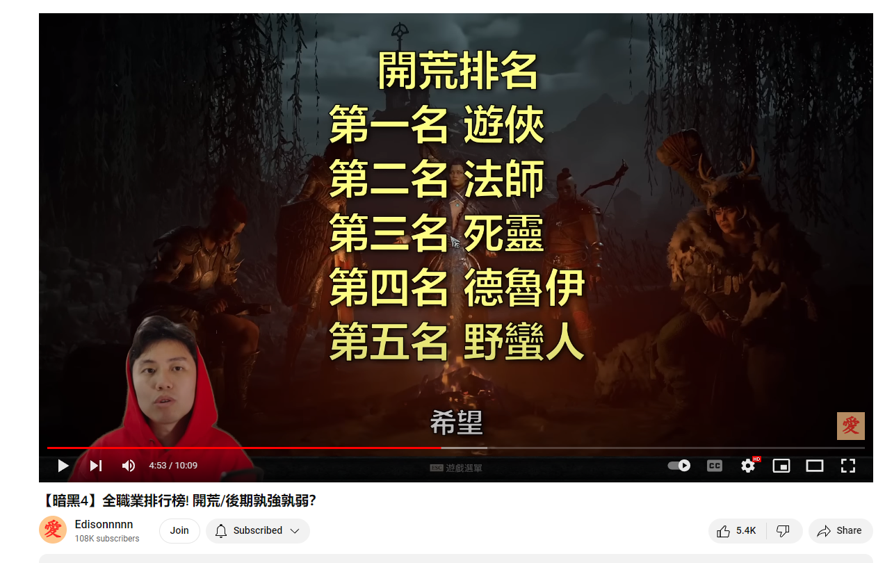
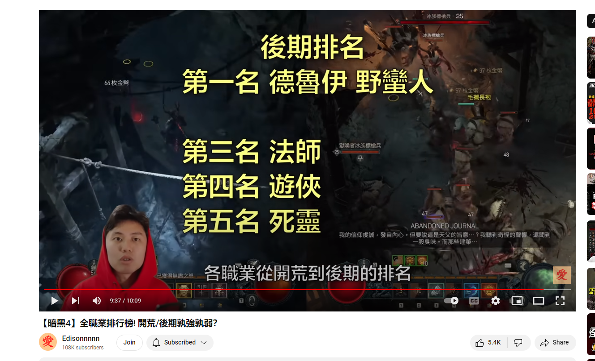

# d4-intro 

## 角色

- Necromancer – frontline assault specialist, excellent crowd control
- Barbarian – melee specialist, high damage potential
- Sorcerer – ranged specialist, strong AoE abilities
- Rogue – ranged and melee combo, highly adaptable skills
- Druid – AoE and single-target mix, solid all-rounder

### 职业：野蛮人

1、野蛮人是一个近战战士，该职业随身携带着“武器库”。

2、因为“武器库”的缘故，该职业可以同时装备4个武器，两把双手武器，两把单手武器。

3、本作中野蛮人还拥有了一个特性，可以由玩家设置使用某种技能时，自动切换为某个武器。

### 职业：德鲁伊

1、德鲁伊是变形大师，由于该职业造成的是魔法伤害，也能说是一种法师。

2、他可以召唤雷霆来造成伤害，也可以在狼、熊和人类三种形态中自由转换。

3、本作4中德鲁伊也有改变，之前变成狼或着熊之后才能使用的法术，现在使用那些法术的时候会自动变成狼或熊。

### 职业：巫师

1、巫师也就是法师，主要是通过各种元素的力量来消灭敌人。

2、巫师的技能法术伤害比较大，又是远程攻击，很容易上手。

3、本作中巫师的特性，是拥有了技能融系统，可以将两个技能绑定在一起释放，一些有联动效果的技能就会打出更高的伤害。

首页 > 游戏攻略 > PC攻略
PC《暗黑破坏神4》冰法怎样低成本续航？冰法低成本续航BD图文攻略
https://www.2023game.com/gonglue/qitaglu/191119.html

### 职业：游侠

1、游侠是适应力强、行动敏捷的战士，可专精远程或近距离战斗。

2、她能够使用强化武器击倒任何敌人、使出威力强大的连续技攻击，他能够使用弓、弩、剑等武器

3、本作中游侠特性也有对应3种：

第一种：连招机制，连招累计连招点、再消耗增加伤害。

第二种：暗影之境，无敌1s，可以将敌人拉入暗影之境全屏控制。

第三种：格挡反击，造成1.6倍暴击。

### 职业：死灵法师

1、死灵法师以操作简单打法休闲著称，一向是中老年玩家的首选。

2、死灵法师主打召唤的风格不变，依然是带领召唤的骷髅亡灵大军进行扫荡。

3、本作中死灵法师的改动，不再需要想以前一样寻找尸体，而是凭空制造尸体。

https://www.yxss.com/gl/103228.html

## 角色推荐

https://www.jxycdx.com/gonglue/18409035.html
fireball sorc 
https://www.youtube.com/watch?v=JH60j67r_e4&ab_channel=TheEggman

## 教程 

https://www.gamersky.com/handbook/202306/1607966.shtml

