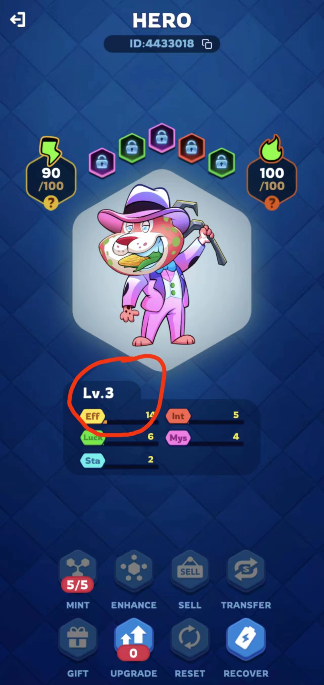

# matchnova 123

欢迎填写我的邀请码 N7K8AK, 这里查看我的联系

入场成本 200U * 5 = 1000 ~ 1100
小投入单号 200U不到 即可

项目方不打算做任何宣传, 靠用户口碑

Matchnova 初心者入門
https://lime-freesia-bcb.notion.site/Matchnova-943fd9e058d34bd4a77e242552c9cfbc

MatchNova分析
https://lime-freesia-bcb.notion.site/MatchNova-cfc5a3a3db6340bf86adb67b70fdf5f1

**每天十場約可存到100~200MCC，日均150MCC，數值為保守估計。(MCC用0.2U計算)，MCC最近維持再0.21U左右**

**回本周期約為30~50天，一般玩家通常35天會回本。尤其轉盤被改動，要打到目標分才有保底倍率**

**雖然看似改少，但作者多帳號的測試，其實收益差不多。**

### 请照以下步骤开新号

1. 盲盒开盒后RESET洗素质(EFF+LUK+STA 超过18以上就可以考虑开局)，上方插槽2绿1红即可开局 ，reset只有第一次是免费，想洗出好素质需要花点钱。自己衡量自身能力
2. 有钱一点的玩家可以三项洗超过25(只有一等可以洗素质)，考虑到后期插槽非常重要 建议3红2绿，3绿2红
3. 卡5等or9等or14等、或是不卡? 三种都有人选择，下方会写4种的区别。
   
前五等
    - 全部点EFF
九等时
    - LUK11
    - STA13
    - 其余配置EFF(可以靠宝石弥补)
14等
    - EFF50+
    - STA15+
    - 太常输可以补一点到LUK增加掉道具机率

升级消耗资源 - https://www.matchnovatwfans.com/%E5%B1%AC%E6%80%A7%E9%85%8D%E9%BB%9E%E4%BB%8B%E7%B4%B9

#### 技能点
- Eff效率：游戏赚取MCC的效率(越高打越多)
- Luck幸运：影响游戏过程中掉落道具的机率，越高道具越强，游戏结束后宝箱掉落机率
- Sta耐力：耐力值较高，角色游戏结束后损失的耐力就会越低
- Int智力：决定你技能充电速度
- Mys神秘：可能在游戏中发生特殊事件(没人知道能干嘛)

### 注意
- 活力：每玩一场会消耗5，低于50会减半你的所有属性（24HR自动恢复）
- 耐力：定期修复，低于50赚钱效率会减半，白玩还可能赔钱。 (只能用MCC修补)
- 活力、耐力低於50 千萬不要再玩，除非你想賠錢

### Luck 

在對戰中Luck幸運素質的高低，影響一局遊戲結束後戰利品箱掉落的機率和等級。並還會影響在遊戲過程中收到道具空投的機會。

| Luck素質 | 道具等級 | 道具內容                          |
| -------- | -------- | --------------------------------- |
| 1-10     | 等級1    | 錘子 刷新                         |
| 11-50    | 等級2    | 藍珠 閃電 超級洗牌 迷你對換  加班 |
| 51-100   | 等級3    | 雷管 迷你大師  傳送               |
| 101+     | 等級4    | 安靜  梅林大師  炸彈快遞          |

在有限的屬性點下，更需要合理進行分配幸運屬性到特定位階，來培養一個強力的角色。

https://www.matchnovatwfans.com/%E9%81%93%E5%85%B7%E4%BB%8B%E7%B4%B9

### 大转盘

在每場比賽結束時，將進行幸運輪盤環節。可以選擇玩幸運旋轉遊戲或跳過它。玩家可壓上比賽獲得的 MCC 獎勵最低倍率0.1最高倍率10倍。

幸運輪盤倍率和機率：
範圍從：10x、5x、3x、2x、1.5x、0.5x 到 0.1x
賠率是：0.1%、0.2%、7%、10%、24.7%、33%、25%

由上面我們可以算出:
(0.1*10+0.2*5+7*3+10*2+24.7*1.5+33*0.5+25*0.1)/100= 0.9905
除非是真正的天選之人，不然以期望值計算，每轉一次轉盤就會少了將近1%。轉越多，虧越多。

珍惜MCC，遠離輪盤。

## 盈利
- 我是周末SEC诉讼的时候入场了, 豹价格0.75 其他地板价格0.71, 再早两天是0.69. 现地板价格0.785

．脚色培养部分
购买一个地板盲盒当主要NFT（资金较充裕者可以多买4个地板NFT增加每日场次），脚色易上手度如下：
猴子＞猫咪＞狐狸＞豹子  （越后面越不利新手游玩）

．培养路径
对于单一帐号的玩家，你需要根据你的游戏风格和角色的特点，进行两个路线的选择：
1. 稳健打金路线（以MCC与繁衍为主要获利）
目标配点EFF50+ Sta15+，头上宝石镶孔以黄蓝色为主，可以等级至9级或14级后停止升级，持续打币及繁衍来获利。

2. 赏金猎人路线（以宝箱及擂台赛为主要获利，高风险高报酬）
目标配点Luck51+ Int15+，头上宝石镶孔以红绿色为主，建议培养高稀有脚色（背板绿色）。

总之，如果你想在MatchNova中取得丰厚的成果，那就需要精心制定策略，并利用游戏中的各种功能和机会。祝你好运！

## 计算
- 单场 大概 10-20 MCC

### 有关 耐力/效率

耐力(火焰标志) = 效率, 耐力 100% = 打金效率 100%

我当前等级 3  

eff效率技能点点到了 14, 角色的技能点 eff越高 打金越多

- 50%的效率  输了 我今早是 5个多币
- 100%的效率 输了 应该有 10个币
所以 
- 100%的效率 赢了 应该有 20个币 至少

## 技巧
- ~~前期如果输了, 尽量用大转盘~~ 大转盘极度不靠谱

## 耐力分析

95.05 - 5.57